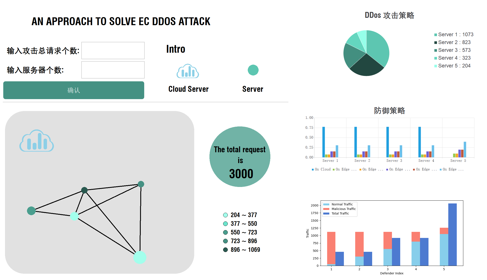

# Visualization of a Solution to Edge Computing DDos Attacks

## Visual interface


## Introduction
This is a visual interface of a DDos solution based on PyQt5.

## Setup
python==3.9.0 PyQt5==5.15.9


### 🚀 Run
```
python main.py
```

## 👀 Contact Me
If you have any questions, please feel free to email me at yue@3184@gmail.com


